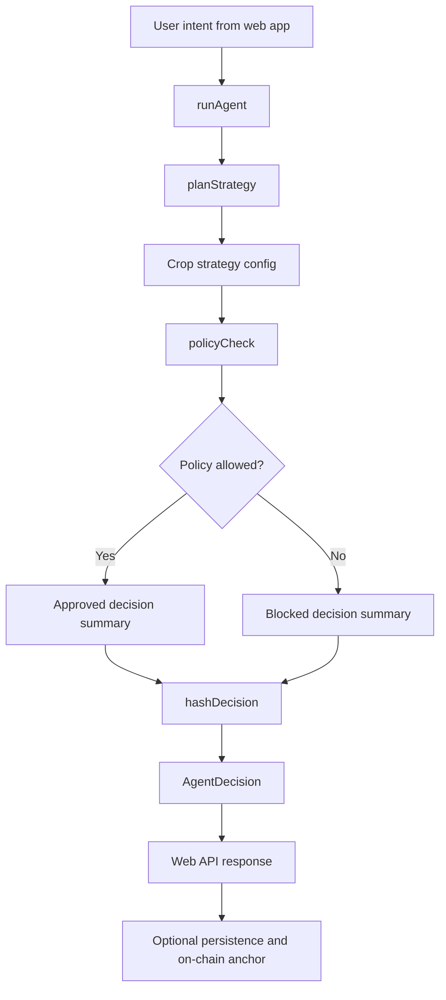
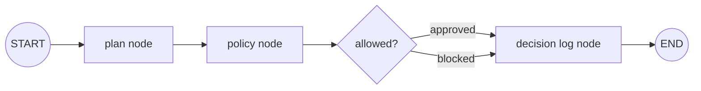

# Gardena Agent

Standalone Agent project for Gardena.

Current local path: `apps/agent`

Target standalone repo: `gardena-agent`

Gardena Agent is the strategy planner and policy decision engine. It receives intent from Gardena App, maps crop choice to a bounded DeFi strategy, applies safety checks, and emits a hashable decision record for App persistence and Gardena Contracts logging.

## Project boundary

This repo owns only Agent concerns:

- strategy planning.
- policy checks.
- decision summaries.
- decision hash generation.
- future LangGraph orchestration.
- future LLM explanation node.

It should not own:

- web UI.
- wallet UX components.
- Solidity contract source.
- contract deployment scripts.

Those belong to:

- `gardena-app` / current `apps/web`
- `gardena-contracts` / current `contracts`

## Current status

- **Implemented:** deterministic planner pipeline in TypeScript.
- **Implemented:** strategy selection from static crop config.
- **Implemented:** deterministic risk policy guardrails.
- **Implemented:** decision hash generation with `viem` `keccak256`.
- **Implemented:** contract deployment config loader.
- **Not fully implemented yet:** actual LangGraph `StateGraph` orchestration. `@langchain/langgraph` exists in `package.json`, but `src/graph.ts` currently runs plain function composition: `planStrategy` → `policyCheck` → `hashDecision`.
- **Not implemented yet:** OpenAI model call/tool use. `@langchain/openai` and `openai` exist as dependencies, but no LLM node is wired yet.
- **Not implemented yet:** live DeFi execution. Policy reason still says user confirmation required before execution.

## Why this exists

Gardena presents DeFi strategies as easy crop choices:

- `steady`: low-risk farming route.
- `growth`: balanced yield route.
- `boost`: higher-risk growth route.

Behind that simple UX, the agent must make bounded decisions that are explainable, auditable, and safe for beginners. This package owns that decision pipeline.

## Architecture



<details>
<summary>ASCII version</summary>

```text
User intent
   |
   v
runAgent
   |
   +--> planStrategy --> CROP_STRATEGIES
   |
   +--> policyCheck --> approved / blocked
   |
   +--> hashDecision --> keccak256(payload)
   |
   v
AgentDecision --> web API --> persistence / on-chain anchor
```
</details>

## Actual code flow

Source: `src/graph.ts`

1. `runAgent(intent, context)` receives an `AgentIntent`.
2. `planStrategy(intent)` selects a predefined strategy from `CROP_STRATEGIES`.
3. `policyCheck({ intent, plan })` validates safety constraints:
   - emergency pause flag must be inactive.
   - amount must be finite, positive, and <= `10_000` default max.
   - plan risk level must be <= user risk preference.
4. `hashDecision(JSON.stringify(...))` creates a `keccak256` decision hash.
5. Function returns `AgentDecision` with summary, plan, policy, hash, timestamp, and optional deployment config.

## LangGraph gap

This repository currently names the core file `graph.ts`, but it does not build a LangGraph graph yet.

Expected LangGraph target:



LangGraph implementation shape should use:

- `Annotation.Root(...)` for shared agent state.
- `new StateGraph(StateAnnotation)` for graph builder.
- `.addNode("plan", planNode)` for each step.
- `.addEdge("__start__", "plan")` and downstream edges.
- `.compile()` then `graph.invoke(input)`.

Until that migration lands, this package is better described as **LangGraph-ready deterministic agent pipeline**, not full LangGraph agent.

## Data contracts

### AgentIntent

```ts
export type AgentIntent = {
  user: `0x${string}`;
  crop: "steady" | "growth" | "boost";
  amount: string;
  riskPreference: 1 | 2 | 3;
};
```

### AgentPlan

```ts
export type AgentPlan = {
  strategyId: string;
  title: string;
  riskLevel: 1 | 2 | 3;
  protocol: string;
  action: string;
  asset: string;
  expectedApy: string;
  steps: string[];
  explanation: string;
};
```

### PolicyDecision

```ts
export type PolicyDecision = {
  allow: boolean;
  status: "approved" | "blocked";
  reason: string;
  checks: Array<{ label: string; pass: boolean; detail: string }>;
};
```

### AgentDecision

```ts
export type AgentDecision = {
  intent: AgentIntent;
  plan: AgentPlan;
  policy: PolicyDecision;
  decisionHash: `0x${string}`;
  summary: string;
  createdAt: string;
  deployment?: DeploymentConfig;
};
```

## Modules

- `src/index.ts`: CLI/dev entry that runs sample intent and prints readiness output.
- `src/graph.ts`: current orchestration entrypoint via `runAgent`.
- `src/nodes/plan.ts`: maps crop ID to strategy config.
- `src/nodes/policy.ts`: deterministic safety checks.
- `src/nodes/log.ts`: decision hash helper.
- `src/config/crops.ts`: strategy catalog for `steady`, `growth`, and `boost`.
- `src/config/contracts.ts`: deployment config loader from env.
- `src/types.ts`: shared TypeScript contracts.

## Package dependencies

Runtime:

- `@langchain/core`: LangChain primitives, currently reserved for planned graph/model nodes.
- `@langchain/langgraph`: planned orchestration runtime, not wired yet.
- `@langchain/openai`: planned LLM integration, not wired yet.
- `openai`: planned direct/model support, not wired yet.
- `viem`: decision hashing and future Mantle/on-chain integration.

Dev:

- `tsx`: local TypeScript runner/watch mode.
- `typescript`: build/typecheck.
- `@types/node`: Node types.

## Environment

```bash
# apps/agent/.env
OPENAI_API_KEY=
MANTLE_RPC_URL=
MANTLE_CHAIN_ID=5000
MANTLE_NETWORK=mantle
AGENT_IDENTITY_ADDRESS=
DECISION_LOG_ADDRESS=
RISK_POLICY_ADDRESS=
PRIVATE_KEY=
```

Current code only needs contract/deployment values if `loadDeploymentConfig()` is expected to return live config. OpenAI and private key are reserved for future model and transaction execution steps.

## Local development

From current system root:

```bash
pnpm install
pnpm --filter @gardena/agent dev
```

From standalone repo root after split:

```bash
pnpm install
pnpm dev
```

Expected sample output:

```text
agent-ready <policy reason> <decision hash>
```

## Build and typecheck

```bash
pnpm --filter @gardena/agent typecheck
pnpm --filter @gardena/agent build
```

Package scripts:

```json
{
  "dev": "tsx watch src/index.ts",
  "build": "tsc -p tsconfig.json",
  "typecheck": "tsc -p tsconfig.json --noEmit"
}
```

## App and Contracts integration

Gardena App (`gardena-app`, current path `apps/web`) calls this Agent package through API routes under `apps/web/src/app/api/agent/*` and stores/anchors decisions with helper modules under `apps/web/src/lib/agent/*`.

Gardena Contracts (`gardena-contracts`, current path `contracts`) provides the intended on-chain primitives for agent identity, policy limits, and decision hash logging.

Main integration path:

```text
apps/web UI
  -> /api/agent/plan
  -> @gardena/agent runAgent(intent)
  -> AgentDecision
  -> local persistence/history
  -> optional on-chain anchor
```

## Safety model

Current safeguards are deterministic and beginner-friendly:

- no execution without user confirmation.
- amount cap defaults to `10_000`.
- strategy risk cannot exceed user risk preference.
- emergency pause input can block all decisions.
- decision payload gets hashed for auditability.

Future safeguards should add:

- protocol allowlist.
- per-user daily exposure limit.
- slippage and gas bounds.
- on-chain policy read before approval.
- human-in-the-loop checkpoint in LangGraph.
- signed execution intent.

## Recommended next implementation: real LangGraph

1. Create `AgentStateAnnotation` in `src/graph.ts` or `src/state.ts`.
2. Convert current functions into LangGraph nodes:
   - `planNode`
   - `policyNode`
   - `logNode`
   - optional `explainNode` for LLM-generated beginner explanation.
3. Compile a graph once and export it.
4. Make `runAgent` async and call `graph.invoke(initialState)`.
5. Keep deterministic policy node before any execution node.
6. Add conditional routing for approved vs blocked decisions.
7. Add tests for blocked risk, blocked amount, approved steady strategy, and stable hash format.

## Roadmap

- [ ] Replace plain function pipeline with LangGraph `StateGraph`.
- [ ] Add explicit state schema and reducer behavior.
- [ ] Add LLM explanation node using `@langchain/openai`.
- [ ] Add human confirmation checkpoint.
- [ ] Read policy limits from `RiskPolicy` contract.
- [ ] Anchor approved/blocked decision hash to `DecisionLog` contract.
- [ ] Add unit tests for strategy, policy, and graph routing.
- [ ] Add dry-run simulation before any transaction execution.

## Standalone split notes

When this folder becomes its own repo:

1. Move contents of `apps/agent/*` to repo root.
2. Keep `src/`, `package.json`, `tsconfig.json`, and this `README.md` at root.
3. Keep package integration stable for Gardena App, or expose an HTTP API if Agent becomes a service.
4. Add real LangGraph `StateGraph` before claiming LangGraph is applied.
5. Do not include App UI files or Contracts source files in this repo.

## Important naming note

`src/graph.ts` is current orchestration file, but not a LangGraph graph yet. README should stay explicit about that so reviewers do not think `@langchain/langgraph` is already applied.
