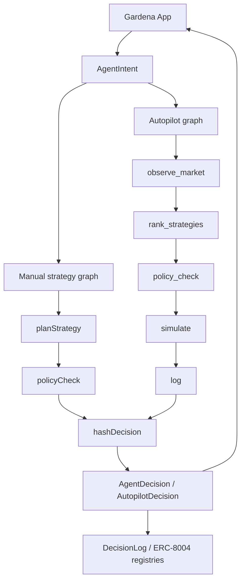
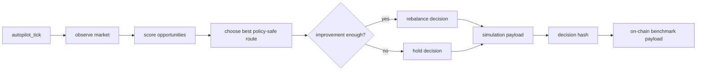

# Gardena Agent

LangGraph-powered agent for **Gardena**, an AI x RWA yield garden on Mantle.

Current local path: `/root/projects/Gardenaz/agent`

Standalone repo: `Gardenaz/agent`

Gardena Agent receives user intent from Gardena App, maps crop choices to USDY/mETH strategy routes, runs policy-safe LangGraph decision flows, scores yield opportunities, and emits hashable decision records for on-chain benchmarking.

## Track fit

- Primary: **AI x RWA** — USDY, mETH, dynamic RWA yield strategy planning and automated risk management.
- Secondary: **Consumer & Viral DApps** — crop labels, shareable harvest notes, readable agent diary payloads.
- Supporting: **Agentic Wallets & Economy** — bounded agent decisions with identity, reputation, and policy context.

## Project boundary

This repo owns Agent concerns only:

- LangGraph orchestration.
- strategy planning.
- market opportunity scoring.
- autopilot tick decisions.
- deterministic policy checks.
- decision summary and decision hash generation.
- ERC-8004 registry context in decision payloads.

It does not own:

- web UI — see `Gardenaz/app`.
- Solidity source/deployments — see `Gardenaz/contracts`.
- custody of user funds.
- Bybit/CEX API execution.

## Stack

- TypeScript
- LangGraph: `@langchain/langgraph`
- LangChain core packages
- viem for hashing and future on-chain interaction
- Node test runner via `tsx --test`

## Architecture



<details>
<summary>ASCII version</summary>

```text
App intent
  |-- manual graph: plan -> policy -> hash
  |
  +-- autopilot graph:
        observe_market
          -> rank_strategies
          -> policy_check
          -> simulate
          -> log
          -> decision hash
  |
  v
App display + optional Mantle proof
```
</details>

## LangGraph status

Implemented.

- `src/graph.ts`
  - compiled manual decision graph.
  - nodes: plan, policy, log.
  - exposed through `createAgentGraph()` and `runAgent()`.
- `src/autopilot.ts`
  - compiled autopilot graph.
  - nodes: `observe_market`, `rank_strategies`, `policy_check`, `simulate`, `log`.
  - exposed through `createAutopilotGraph()` and `runAutopilotTick()`.

## Strategy catalog

- `steady` → Rice / Safe Harvest
  - strategy: `steady-rwa-usdy`
  - asset: `USDY`
  - route: `Mantle RWA USDY Route`
  - risk: low
- `growth` → Corn / Growth Field
  - strategy: `growth-meth-yield`
  - asset: `mETH`
  - route: `Mantle mETH Yield Route`
  - risk: medium
- `boost` → Chili / Boost Farm
  - strategy: `boost-rwa-meth-dynamic`
  - asset: `USDY/mETH`
  - route: `Mantle Dynamic RWA Route`
  - risk: higher

## Autopilot flow



Scoring uses:

```text
score = expectedApy - riskPenalty - gasPenalty - liquidityPenalty + confidenceBonus
```

Policy safety checks:

- autopilot must be enabled.
- emergency pause must be inactive.
- amount must stay inside user max transaction amount.
- opportunity risk must be <= user max risk.
- protocol must be allowlisted.
- selected route must improve enough before rebalance.

## Data contracts

### AgentIntent

```ts
type AgentIntent = {
  user: `0x${string}`;
  crop: "steady" | "growth" | "boost";
  amount: string;
  riskPreference: 1 | 2 | 3;
};
```

### AutopilotIntent

```ts
type AutopilotIntent = {
  user: `0x${string}`;
  agentId: string;
  amount: string;
  currentStrategyId?: string;
  minImprovementBps: number;
  policy: {
    enabled: boolean;
    maxTxAmount: string;
    maxDailyLoss: string;
    maxRiskLevel: 1 | 2 | 3;
    rebalanceIntervalSeconds: number;
    allowedProtocols: string[];
    emergencyPaused: boolean;
  };
};
```

### AutopilotDecision

```ts
type AutopilotDecision = {
  intent: AutopilotIntent;
  action: { kind: "rebalance" | "hold" | "blocked"; reason: string };
  market: { observedAt: string; opportunities: YieldOpportunity[] };
  rankedOpportunities: ScoredYieldOpportunity[];
  selectedOpportunity?: ScoredYieldOpportunity;
  simulation?: { ok: boolean; estimatedGasUsd: number; expectedNetApyBps: number; warnings: string[] };
  decisionHash: `0x${string}`;
  erc8004: { agentId: string; registries: Record<string, `0x${string}` | undefined> };
  track: { primary: "AI x RWA"; secondary: "Consumer & Viral DApps"; support: "Agentic Wallets & Economy" };
};
```

## Environment

```bash
MANTLE_RPC_URL=
MANTLE_CHAIN_ID=5000
MANTLE_NETWORK=mantle
AGENT_IDENTITY_ADDRESS=
DECISION_LOG_ADDRESS=
RISK_POLICY_ADDRESS=
REPUTATION_REGISTRY_ADDRESS=
VALIDATION_REGISTRY_ADDRESS=
AUTOPILOT_POLICY_ADDRESS=
PRIVATE_KEY=
OPENAI_API_KEY=
```

Current code does not require `OPENAI_API_KEY` for deterministic tests. `PRIVATE_KEY` is reserved for future execution adapter work.

## Development

```bash
pnpm install
pnpm test
pnpm typecheck
pnpm build
```

## Key files

- `src/graph.ts` — manual LangGraph decision pipeline.
- `src/autopilot.ts` — autopilot yield optimizer graph.
- `src/config/crops.ts` — USDY/mETH crop strategies.
- `src/config/contracts.ts` — Mantle contract config loader.
- `src/nodes/plan.ts` — crop-to-strategy planner.
- `src/nodes/policy.ts` — deterministic guardrails.
- `src/nodes/log.ts` — decision hash helper.
- `src/types.ts` — shared Agent and Autopilot types.
- `src/*.test.ts` — graph/autopilot test coverage.

## Verification status

Expected green commands:

```bash
pnpm test
pnpm typecheck
pnpm build
```

Latest implemented scope:

- LangGraph manual graph.
- LangGraph autopilot graph.
- AI x RWA strategy metadata for USDY/mETH.
- consumer/share metadata in decision payloads.
- ERC-8004 registry context in autopilot decisions.
- dry, deterministic market inputs for demo/testing.

Not implemented yet:

- real protocol fund movement.
- on-chain transaction execution adapter.
- Bybit API adapter.
- hosted agent API server.
